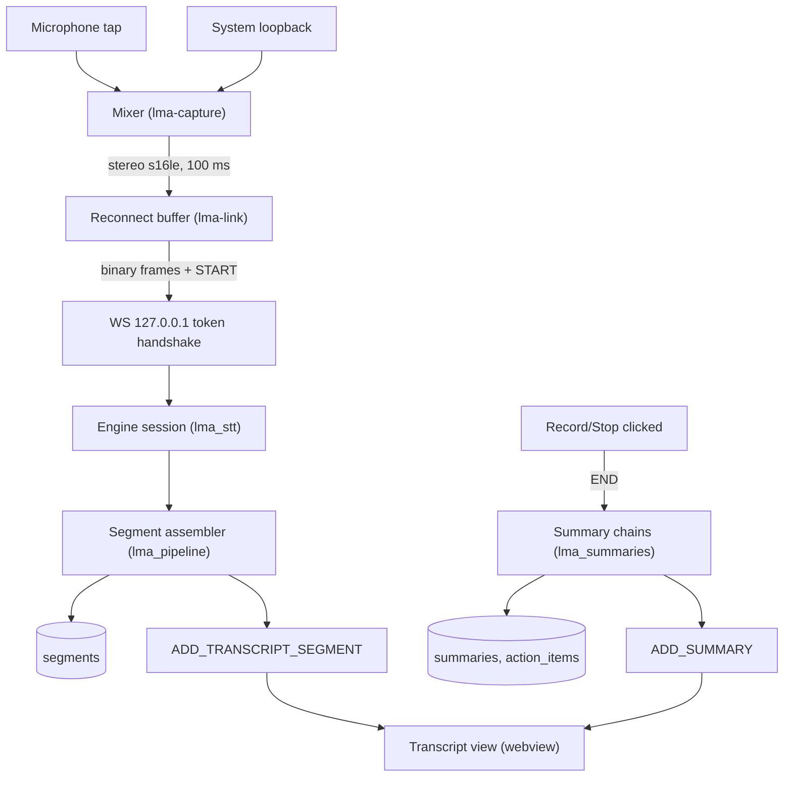
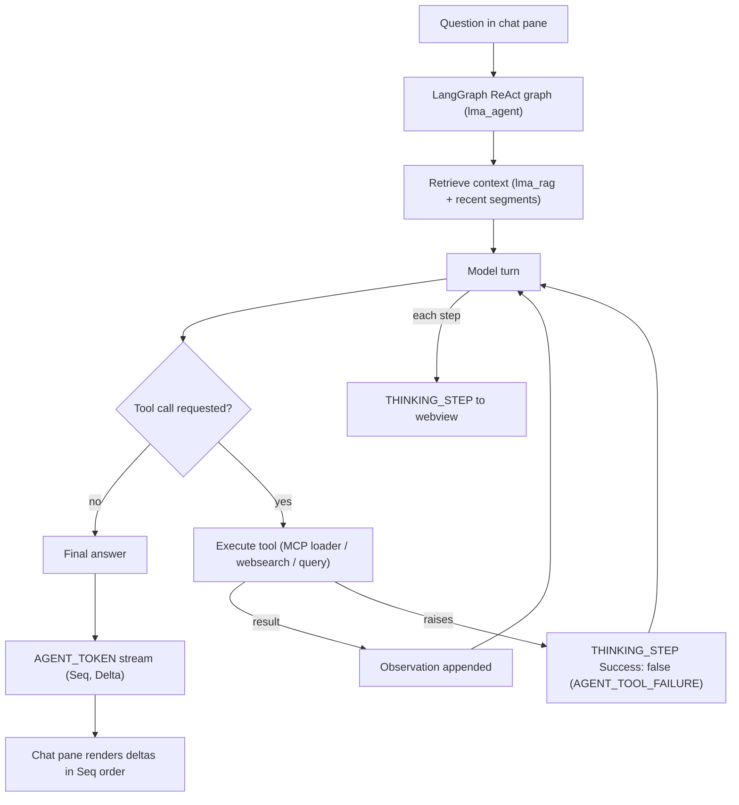
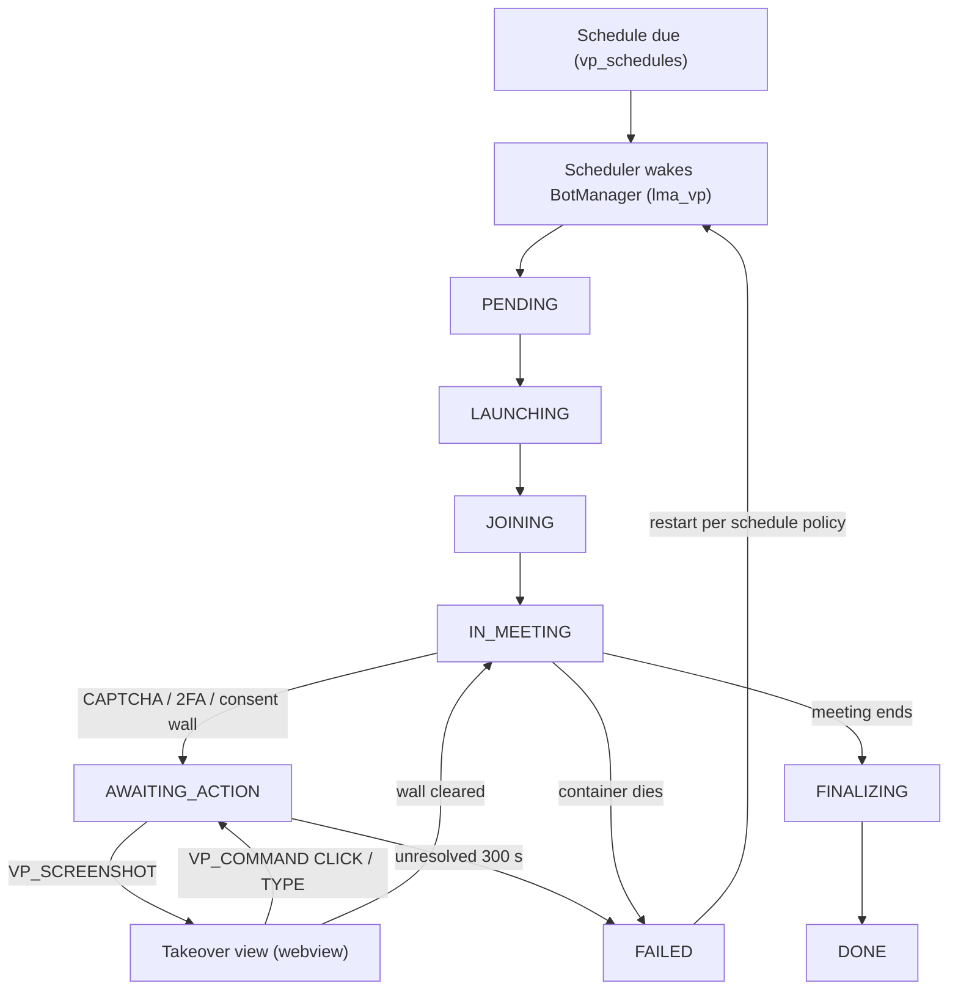

# Developer Guide

Architecture, process model, data flows, and testing strategy.

## Architecture

Two processes on the user's machine:

```
┌─ Tauri 2 (Rust) ─────────────────────────────────────┐
│  crates/app      shell, commands, state              │
│  crates/lma-capture   dual-mono mic + loopback, mixer│
│  crates/lma-link     WS client to sidecar            │
│  ui/             React TS webview                    │
└──────────────┬───────────────────────────────────────┘
               │ one WebSocket, 127.0.0.1, token handshake
┌──────────────▼───────────────────────────────────────┐
│  python/sidecar                                      │
│  lma_stt        Engine trait + provider adapters     │
│  lma_pipeline   segment assembly + speaker smoothing │
│  lma_agent      LangGraph ReAct, tools, MCP loader   │
│  lma_summaries  per-section summary chains           │
│  lma_rag        sqlite-vec ingest + retriever        │
│  lma_vp         bot manager, platform adapters       │
└──────────────────────────────────────────────────────┘
```

SQLite lives in a single WAL-mode file with one rule: **every table has
exactly one owning writer process** — no table is ever written by both.

| Owned by Rust shell | Owned by Python sidecar |
|---|---|
| `settings`, `prompt_templates`, `mcp_servers`, `vp_schedules` | `meetings`, `segments`, `summaries`, `action_items`, `rag_chunks`, `vp_tasks` |

UI edits to sidecar-owned rows (ticking an action item, editing meeting
titles) go through Tauri commands that execute parameterized writes on the
shell's own connection — ownership is per *table*, not per *process intent*.
Both processes run WAL mode with `busy_timeout`; readers never block.

The sidecar owns transcript **time-offset continuity** across reconnects;
the client link layer only buffers audio and never adjusts timestamps.

The [Virtual Participant](virtual-participant.md) container streams its
audio and receives control commands over the same wire contract as desktop
capture ([WebSocket Streaming API](websocket-streaming-api.md)).

## Repository layout

```text
crates/app           Tauri shell: commands, event forwarding, app state
crates/lma-capture   device enumeration, SCK shim, WASAPI loopback, mixer
crates/lma-link      sidecar WS client: framing, reconnect buffer, backoff
ui/                  React TS webview
python/sidecar/      entrypoint, WS server, event bus, lifecycle supervisor
python/lma_stt/      Engine protocol + deepgram | assemblyai | azure adapters
python/lma_pipeline/ word items → segments: runs, windows, stable IDs
python/lma_agent/    LangGraph ReAct graph, tools, MCP loader
python/lma_summaries/ section chains, template registry, action extraction
python/lma_rag/      chunker, embedders, sqlite-vec store, retriever
python/lma_vp/       scheduler, BotManager, platform adapters, takeover bridge
vp-container/        image recipe + compose
contracts/           events.schema.json, errors.yaml  ← single source of truth
prompts/             default templates: summary sections, chat buttons
```

## Build and test reference

Every component is testable without the others; run from the repo root.

**Rust workspace** (`crates/*`, after `cargo build`):

| Command | Covers |
|---|---|
| `cargo test -p lma-capture` | mixer drain math, mute zero-fill, int16 conversion clamps, device-rebuild state machine |
| `cargo test -p lma-link` | framing, ≤3 s reconnect-buffer eviction, backoff schedule, single-flight connect guard |
| `cargo test -p app` | Tauri commands, parameterized writes on Rust-owned tables, reader half of WAL concurrency tests |
| `cargo clippy --workspace --all-targets -- -D warnings` | lint gate |

**Python workspace** (`uv sync --all-packages` first — plain `uv sync`
does not install the workspace members `lma-stt` and `lma-pipeline` as
editable installs, so cross-package imports fail on a fresh clone):

| Command | Covers |
|---|---|
| `uv run pytest python/lma_stt` | Engine protocol conformance, per-provider adapters against recorded fixtures |
| `uv run pytest python/lma_pipeline` | segment assembler characterization: runs, windows, stable IDs, partial→final overwrite |
| `uv run pytest python/lma_agent` | graph execution with stubbed tools, MCP loader |
| `uv run pytest python/lma_summaries` | section chains, template registry merge, action-item extraction |
| `uv run pytest python/lma_rag` | chunker, embedders, sqlite-vec store, retriever |
| `uv run pytest python/lma_vp` | scheduler, BotManager, platform adapters against the fake meeting page |
| `uv run pytest python/sidecar` | WS contract against a fake STT engine, lifecycle supervisor, writer half of WAL concurrency tests |

**Contract validation** — both sides fail independently when a frame shape
drifts:

| Command | Asserts |
|---|---|
| `cargo test -p lma-link --test wire_contract` | every Rust frame type serializes to a `contracts/events.schema.json`-valid payload; known-good JSON parses back |
| `uv run pytest python/sidecar/tests/test_wire_contract.py` | same guarantee for the Python event builders |
| `cargo test -p app --test error_catalog` | Rust error registry matches `contracts/errors.yaml`: codes, severities, recovery actions parsed and compared |
| `uv run pytest python/sidecar/tests/test_error_catalog.py` | same file parsed on the Python side; unknown codes raise |

**Fixture regeneration** — recordings are inputs of record, never edited by
hand:

1. Reproduce the scenario against the real provider with a live API key;
   a fixture change starts there, not in an editor.
2. Save raw provider payloads into `python/lma_stt/tests/fixtures/<provider>/`
   next to the expected normalized `Result`s.
3. For pipeline changes, regenerate expected segment emissions into
   `python/lma_pipeline/tests/fixtures/` from unchanged word-item inputs,
   then review the golden-output diff before committing.
4. Commit recording and expected output together; a change that invalidates
   fixtures is a contracts change (step 1 of [Contracts workflow](#contracts-workflow)).

## Key interfaces

**STT engine boundary** (`python/lma_stt`) — the only place vendor SDKs are
imported:

```python
class MeetingContext(TypedDict):
    call_id: str
    sample_rate: int                       # from START frame
    diarize: dict                          # {"system": bool, "mic": bool}
    language_hints: list[str]              # may be empty

class WordItem(TypedDict):
    content: str
    type: Literal["pronunciation", "punctuation"]
    start_time: float                      # seconds from stream start
    end_time: float
    speaker: str | None                    # "spk_N" or None
    channel: Literal["CALLER", "AGENT"]    # assigned by the adapter
    result_id: str                         # engine-result identity; adapters
                                           # synthesize one when the provider
                                           # has no native equivalent

class Engine(Protocol):
    async def start(self, ctx: MeetingContext) -> ResultStream: ...

class ResultStream(Protocol):
    async def feed(self, pcm: bytes) -> None: ...      # 100 ms stereo chunks
    async def close(self) -> None: ...                 # graceful stream end
    def __aiter__(self) -> AsyncIterator[Result]: ...

class Result(TypedDict):
    """One engine result boundary: items + finality."""
    result_id: str
    is_final: bool                 # labels only appear on finals
    items: list[WordItem]
```

Auth failures raise `ProviderAuthError`; mid-stream transport failures raise
`ProviderResetError` — the sidecar maps these to `STT_PROVIDER_AUTH` /
`STT_STREAM_RESET`.

**Topology**: one multichannel engine session per meeting (stereo in,
per-channel results out) — mirroring upstream's channel identification.
Adapters that only support mono open one Engine per channel behind the same
interface.

**Segment assembler** (`python/lma_pipeline`) — pure, no I/O; consumes
`Result`s per channel and emits settled partial/final windows with stable
IDs. All thresholds are constructor arguments so tests pin behavior.

**Mixer and link** (`crates/lma-capture`, `crates/lma-link`) — see
[Desktop Capture App](desktop-capture-app.md#capture-internals-crateslma-capture)
for buffer math and state machine parameters.

## Contracts workflow

1. Change `contracts/events.schema.json` or `contracts/errors.yaml` first.
2. Both language sides validate payloads against them in CI — a schema
   change without both sides updated is red.
3. Provider fixtures live beside adapters:
   `python/lma_stt/tests/fixtures/<provider>/` — recorded real payloads,
   never hand-written guesses.
4. Ported pure algorithms get characterization tests from known-good
   fixtures **before** implementation changes (TDD).

## Process model and IPC

Text frames carry JSON, binary frames carry audio:

- Rust → sidecar: `START`, `SPEAKER_CHANGE`, `PAUSE`, `RESUME`, `END`,
  `AGENT_QUERY`, `VP_COMMAND`, plus binary stereo PCM (48 kHz, 100 ms chunks)
- Sidecar → Rust: `ADD_TRANSCRIPT_SEGMENT`, `ADD_SUMMARY`,
  `ADD_AGENT_ASSIST`, `AGENT_TOKEN`, `THINKING_STEP`, `VP_STATUS`,
  `VP_SCREENSHOT`, `ERROR`

Canonical JSON schemas live in `contracts/events.schema.json`; both sides
validate against them in tests.

`lma-link` reconnects with a bounded ≤3 s buffer (oldest dropped, flushed on
reopen), exponential backoff 0.5–10 s, a single-flight connect guard, and a
fresh `START` (same `CallId`) after every disconnect. The sidecar carries a
cumulative time offset into the new session, keeping segment timestamps
continuous; the link layer never adjusts times.

## Data model

Single SQLite file:

| Table | Owner | Purpose |
|---|---|---|
| `meetings` | sidecar | id, title (Rust-editable), source `LOCAL`\|`VP`, platform, status, started_at, ended_at, duration_ms, recording paths |
| `segments` | sidecar | segment_id (stable PK), meeting_id, channel `CALLER`\|`AGENT`\|`AGENT_ASSISTANT`, speaker, start_ms/end_ms, text, original_text, is_partial, sentiment_score |
| `summaries` | sidecar | meeting_id, section, content |
| `action_items` | sidecar | meeting_id, description, detail, owner, due_date, status (`open`\|`done`), source_segment_id |
| `prompt_templates` | Rust | scope (`summary`\|`chat_button`), key, layer `default`\|`custom`, sort_order |
| `settings` | Rust | key, value_json |
| `mcp_servers` | Rust | server_id, transport, url_or_package, status, auth_ref → OS keychain |
| `vp_schedules` | Rust | id, platform, meeting_url, rrule, options_json, enabled |
| `vp_tasks` | sidecar | id, schedule_id?, meeting_url, state, container_id, started_at, ended_at |
| `rag_chunks` | sidecar | id, meeting_id, text, embedding, start_ms/end_ms, channel, speaker, created_at |

Partial transcript updates overwrite by primary key — finals replace their
partials in place. Wire timestamps arrive in float seconds and are converted
to integer milliseconds once, at the DB write boundary. Recordings are files
under `<app-data>/recordings/`.

## Settings registry

Keys read by code (all under `settings.key`):

| Key | Type | Default |
|---|---|---|
| `stt.provider` / `stt.api_key_ref` | enum / keychain ref | `deepgram` |
| `stt.language_hints` | string[] | `[]` (auto) |
| `capture.sample_rate` | int | `48000` |
| `diarize.system` / `diarize.mic` | bool | `false` |
| `llm.provider` / `llm.model` / `llm.api_key_ref` | — | provider default |
| `llm.summary_temperature` / `llm.agent_temperature` | float | `0.0` / `0.3` |
| `assistant.wake_pattern` | regex string | `(OK\|Okay)[.,! ]*[Aa]ssistant` |
| `assistant.wake_channels` | enum[] | `["CALLER"]` |
| `embeddings.provider` | `local` \| cloud id | `local` |
| `websearch.provider` / `websearch.api_key_ref` | — | unset (tool hidden) |
| `translation.enabled` | bool | `false` |
| `domain` | `standard` \| `healthcare` | `standard` |

## Error catalog

All errors flow through `contracts/errors.yaml`; each entry declares
`{code, source, severity, recovery, ui_message_key}` and both languages
consume the same file. Recovery actions are declarative — the runtime
executes them, the UI translates codes to messages.

| Code | Automatic recovery |
|---|---|
| `STT_PROVIDER_AUTH` | stop stream, surface settings UI |
| `STT_STREAM_RESET` | five consecutive failures stop the stream; a session that survived ≥10 s resets the counter; backoff 0.5–10 s |
| `LINK_DISCONNECTED` | flush reconnect buffer (≤3 s), fresh `START`, same `CallId` |
| `CAPTURE_DEVICE_LOST` | rebuild streams on device-change notification |
| `CAPTURE_PERMISSION_DENIED` | open OS privacy settings |
| `VP_CONTAINER_FAILED` | restart container per schedule policy |
| `VP_MANUAL_ACTION_REQUIRED` | escalate screenshots to UI takeover; 300 s timeout → FAILED |
| `AGENT_TOOL_FAILURE` | emit failed thinking step, continue graph |
| `RAG_EMBEDDING_UNAVAILABLE` | defer ingest job |
| `DB_WRITE_CONFLICT` | retry with backoff (max 5) |
| `SIDECAR_UNAVAILABLE` | respawn sidecar, reissue token |
| `PORT_BIND_FAILED` | retry next port (max 10) |

The machine-readable catalog — codes, sources, severities, recovery
actions — lives in `contracts/errors.yaml`. Keep it small and real; add
entries when a failure mode earns a dedicated recovery path.

## Testing

Pyramid with TDD throughout (red-green-refactor):

- **Unit** — characterization tests written first for every ported pure
  algorithm: speaker-run smoothing/windowing, mixer chunk math, stable
  segment IDs, prompt merge semantics, per-provider payload normalization
  against recorded fixtures, event schema round-trips.
- **Integration** — sidecar WS contract against a fake STT engine;
  concurrent WAL access (Rust reader × Python writer); agent graph with
  stubbed tools; VP container joining a locally served fake meeting page.
- **End-to-end** — a few scripted flows (local capture to live transcript;
  full VP join). Not a CI gate.

Cross-language contracts are enforced automatically against
`contracts/events.schema.json`.

Fixtures live beside the code they pin. `python/lma_stt/tests/fixtures/<provider>/`
holds recorded provider payloads — real bytes captured from live providers,
organized per adapter. `python/lma_pipeline/tests/fixtures/` carries
word-item streams paired with their expected segment emissions.
`crates/lma-capture/tests/` pins mixer PCM vectors: input stereo buffers
plus exact expected interleaved output, covering mute zero-fill and
partial-tick carryover. Regeneration rules are in
[Build and test reference](#build-and-test-reference).

## Flow walkthroughs

The three core flows end to end; wire-level sequence diagrams for the first
live in [WebSocket Streaming API](websocket-streaming-api.md#sequence-diagrams).

### Local meeting lifecycle



### Chat question through the agent graph



### VP container supervision



State transitions persist to `vp_tasks`; the 300 s escalation timeout and
the FAILED-on-timeout rule come from `VP_MANUAL_ACTION_REQUIRED` in
`contracts/errors.yaml`.
