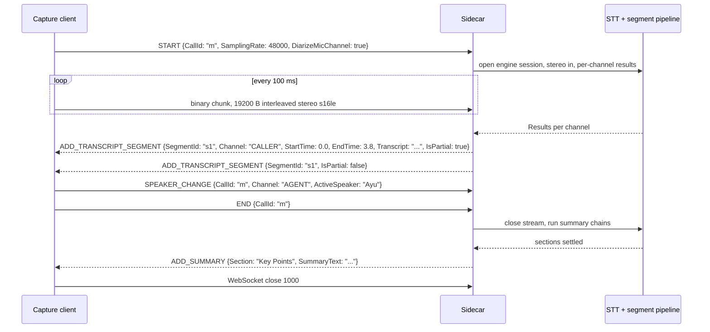
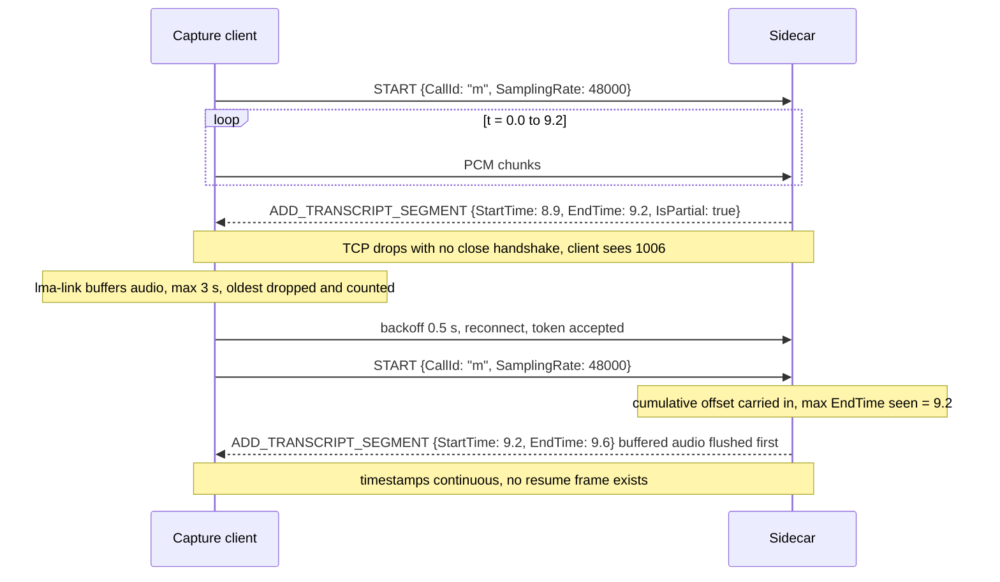
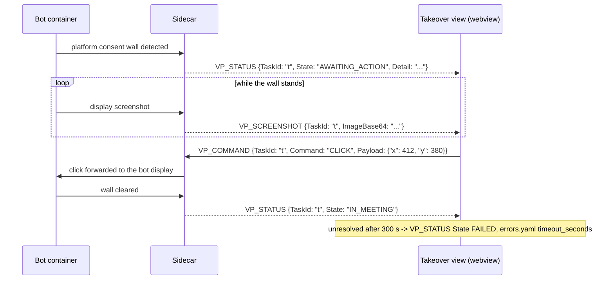

# WebSocket Streaming API

Full protocol specification for streaming clients that feed meetings into
oss-lma — useful for custom capture frontends, tests, and integrations.

> The canonical machine-readable contract is
> `contracts/events.schema.json` (JSON Schema, draft 2020-12) plus
> `contracts/errors.yaml` for error codes. This document is the human guide;
> the schema is the source of truth and both language sides validate against
> it in CI.

> The desktop app speaks this same protocol to the sidecar; anything that
> implements it becomes a meeting source. See
> [Transcription & Translation](transcription-and-translation.md) for what
> happens downstream.

## Wire conventions

- **Text frames** are JSON events; **binary frames** are audio.
- All JSON keys are **PascalCase** on the wire (`CallId`, not `call_id`) —
  matching every example below. Language-native structs convert at their own
  boundary.
- Wire timestamps are float seconds from stream start; SQLite stores integer
  milliseconds (conversion happens once, at the DB write boundary inside the
  sidecar).

## Endpoint

```
ws://127.0.0.1:<port>/ws?token=<handshake-token>
```

### Sidecar lifecycle

The sidecar is spawned by the shell as a child process:

1. The sidecar binds a random localhost port, retrying up to 10 attempts if
   a bind fails (`PORT_BIND_FAILED`).
2. It prints one line to stdout: `SIDECAR_READY port=<port>
   token=<hex>` — the only stdout line the shell parses.
3. The token is random per sidecar process. It stays valid for the
   process's lifetime, so reconnecting clients reuse it; it is reissued
   only when the shell respawns the sidecar (`SIDECAR_UNAVAILABLE`).
4. A client that presents no token or a stale token after a respawn gets
   HTTP 401 on the upgrade request.

Containers reach the same endpoint through `host.docker.internal`
([Virtual Participant](virtual-participant.md)) with the token passed as an
environment variable.

## Control messages (client → sidecar)

### START

Begins a meeting session:

```json
{
  "EventType": "START",
  "CallId": "<uuid>",
  "SamplingRate": 48000,
  "DiarizeSystemChannel": false,
  "DiarizeMicChannel": true
}
```

Diarization flags default to false; enable them when several people share a
channel ([Desktop Capture App](desktop-capture-app.md#optional-identify-separate-speakers)).

### SPEAKER_CHANGE

Declares who is currently speaking into **one named channel**:

```json
{ "EventType": "SPEAKER_CHANGE", "CallId": "...",
  "Channel": "AGENT", "ActiveSpeaker": "Ayu" }
```

`Channel` is required — with two mono sources there is no implicit "current"
side. Non-diarized items on that channel bin against this name until the
next change.

### PAUSE / RESUME

One mechanism, stated once: `PAUSE` makes the sidecar consume and discard
audio while keeping the session open; capture-side pause sends this frame
and does not additionally discard locally.

```json
{ "EventType": "PAUSE", "CallId": "..." }
```

### END

Finalizes the meeting and triggers summarization.

```json
{ "EventType": "END", "CallId": "..." }
```

### VP_COMMAND

Drives an in-flight [Virtual Participant](virtual-participant.md) session
(manual takeover, chat commands):

```json
{ "EventType": "VP_COMMAND", "TaskId": "<task-uuid>",
  "Command": "CLICK", "Payload": {"x": 412, "y": 380} }
```

Commands: `CLICK`, `TYPE`, `CHAT`, `RESET_SELECTORS`, `END`, `PAUSE`,
`RESUME`.

### AGENT_QUERY

Asks the [Meeting Assistant](meeting-assistant.md) a question — chat panel,
shortcut buttons, and wake-phrase replies all enter here:

```json
{ "EventType": "AGENT_QUERY", "CallId": "...", "QueryId": "<uuid>",
  "Message": "What did we just discuss?",
  "History": [{"Role": "user", "Content": "…"},
              {"Role": "assistant", "Content": "…"}] }
```

`History` carries up to 10 prior turns. The sidecar correlates every
`AGENT_TOKEN` and `THINKING_STEP` it streams back by `QueryId`; the final
answer also lands as an `ADD_AGENT_ASSIST` segment.

## Audio (client → sidecar)

Binary frames carry interleaved stereo signed 16-bit little-endian PCM at
the `SamplingRate` declared in `START`. Channel 0 = system/meeting audio
(`CALLER`), channel 1 = microphone (`AGENT`).

The canonical chunk is **exactly 100 ms**:

```text
bytes_per_chunk = SamplingRate × 2 channels × 2 bytes × 0.1 s
                = 19,200 B @ 48 kHz
```

Larger frames are re-chunked to this size on arrival; smaller ones are
buffered up to it, so downstream consumers always see fixed-size chunks.

### Reconnect timeline

There is no session resume. After any drop the client reconnects and sends a
fresh `START` **with the same `CallId`** — segments and summaries continue
one meeting record. The sidecar carries a cumulative time offset (max end
time seen) into the new session, so timestamps never go backwards; the
client-side link layer only buffers, it never adjusts times.

```text
t=0.0s  START {SamplingRate: 48000}      → segments at 0.00–…
t=9.2s  connection drops                 → client buffers audio
        buffer holds ≤3 s (oldest dropped + counted)
t=9.6s  reconnect OK                     → START again, same CallId
        buffered 0.4 s flushed first, live audio resumes
```

Backoff schedule: first retry after 0.5 s, doubling to a 10 s ceiling;
the counter resets once a connection survives long enough to send `START`.
Concurrent reconnect attempts collapse into one (single-flight guard).

## Events (sidecar → client)

| Event | Payload |
|---|---|
| `ADD_TRANSCRIPT_SEGMENT` | `{SegmentId, Channel, Speaker, StartTime, EndTime, Transcript, IsPartial}` |
| `ADD_SUMMARY` | `{Section, SummaryText}` |
| `ADD_AGENT_ASSIST` | `{SegmentId, TriggerSegmentId, Transcript, IsPartial}` |
| `AGENT_TOKEN` | `{QueryId, Seq, Delta}` |
| `THINKING_STEP` | `{QueryId, Seq, StepType, Content?, ToolName?, ToolInput?, ToolResult?, Success?}` |
| `VP_STATUS` | `{TaskId, State, Detail?}` |
| `VP_SCREENSHOT` | `{TaskId, ImageBase64}` |
| `ERROR` | `{Code, Context}` |

All carry the envelope `{EventType, CallId}`. Full field constraints live in
`contracts/events.schema.json`; every field above is PascalCase on the wire.

Segment IDs stay stable across partial→final transitions — overwrite by
`SegmentId` to track updates. After any disconnect, start a fresh session
with `START` (same `CallId`); there is no resume.

## Sequence diagrams

Wire-level views of the three flows every client must survive. Frame shapes
are exactly as specified above; validate them against
`contracts/events.schema.json`.

### Local capture session



### Reconnect mid-meeting



### VP takeover



## Close and error semantics

Close codes as exchanged between a streaming client (desktop app or
[Virtual Participant](virtual-participant.md) container) and the sidecar:

| Code | Sent by | Meaning | Client reaction |
|---|---|---|---|
| `1000` Normal Closure | either side | Deliberate shutdown — the sidecar after `END` processing completes, the client when capture stops | None; the meeting record is already finalized |
| `1006` Abnormal Closure | nobody (stack-derived) | Never travels the wire; surfaced when the TCP stream dies without a close handshake — sidecar crash, process kill, laptop sleep | Reconnect path: buffer ≤3 s of audio, backoff 0.5–10 s, fresh `START`, same `CallId` (`LINK_DISCONNECTED`) |
| `1011` Internal Error | sidecar | Unrecoverable fault inside the session handler | Same reconnect path as `1006`; if the fault ended the process, the shell respawns the sidecar and the old token stops working (`SIDECAR_UNAVAILABLE`) |

Token problems surface before any WebSocket exists: a missing, malformed, or
stale token fails the HTTP upgrade with **401 Unauthorized** — no frames are
exchanged, and retrying with the same token cannot succeed. Tokens are
reissued only by a sidecar respawn.

Inside a healthy socket, failures arrive as `ERROR` frames:

```json
{ "EventType": "ERROR", "CallId": "...", "Code": "STT_PROVIDER_AUTH",
  "Context": {"Provider": "deepgram"} }
```

`Code` is always a code from `contracts/errors.yaml`; `Context` carries
whatever the declared recovery action needs (attempt counts, provider
names, device ids). Dispatch on `Code`, never on message text — the
human-facing string lives behind `ui_message_key` in the catalog. Severity
decides scope: `retryable` codes leave the session usable, `fatal-*` codes
end the stream or demand a respawn per the catalog's `recovery` action.

## Client checklist

Each item traces to a rule stated above:

- Read `port` and `token` from the single `SIDECAR_READY port=<port>
  token=<hex>` stdout line — no other stdout line is addressed to you. Put
  the token in `?token=` on the upgrade URL (containers receive it as
  `SIDECAR_TOKEN`).
- Generate one UUID `CallId` per meeting and reuse it on **every**
  reconnect `START`; a new `CallId` forks a second meeting record.
- Send `START` before the first binary frame, with `SamplingRate` set to
  your real PCM rate (minimum 8000).
- Emit exact 100 ms chunks — 19,200 B at 48 kHz. Larger frames are
  re-chunked and smaller ones buffered on arrival, but sending fixed-size
  keeps channel alignment trivial.
- Key transcript rendering on `SegmentId`: each partial replaces the prior
  frame in place and `IsPartial: false` finalizes that same id. Appending
  instead of overwriting duplicates text.
- Never adjust timestamps client-side. Times are float seconds from stream
  start; after a reconnect the sidecar applies the cumulative offset —
  render `StartTime`/`EndTime` as received.
- Treat `PAUSE` as server-side consume-and-discard: keep the socket and the
  100 ms cadence running so the two channels stay aligned.
- Back off reconnects: 0.5 s doubling to a 10 s ceiling, single-flight
  (concurrent attempts collapse into one), counter resetting once a
  connection survives long enough to send `START`.
- Dispatch `ERROR` frames on `Code` against `contracts/errors.yaml`;
  resolve display text through `ui_message_key`.
- Round-trip every frame you emit and accept against
  `contracts/events.schema.json` in tests — both language sides enforce it
  in CI, and hand-built frames drift.
